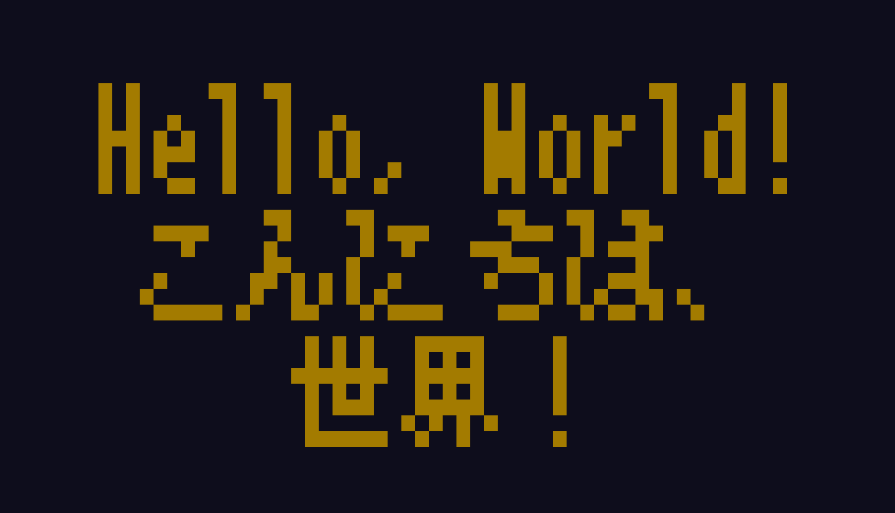

# term-banner

Show a banner in your terminal.

## Supported characters

* All of ASCII characters
* Some of Japanese Kanji and symbols (JIS第一・第二水準)

Special thanks to Num Kadoma, the author of the awesome font!


# Usage

Pass a messsage as command line arguments:

```
$ ./term-banner 'Hello, World!'
```

Multiple arguments are displayed in multiple lines.

```
$ ./term-banner foo bar baz
```

Switch font by `-f`:

```
$ ./term-banner -f gothic 'あいうえお'
```


# Requirements

* Go toolchains


# Build

1. Clone this repository.
2. `make build`


# Screenshot

```
$ make test
```




# License

This program uses [美咲フォント 2021-05-05a 版](https://littlelimit.net/misaki.htm) for rendering Japanese text.
Note that the license and copyright holder of the font is different from the program's.

See [assets/misaki.txt](./assets/misaki.txt) for license of font.

See [LICENSE](./LICENSE) for license of the program.
